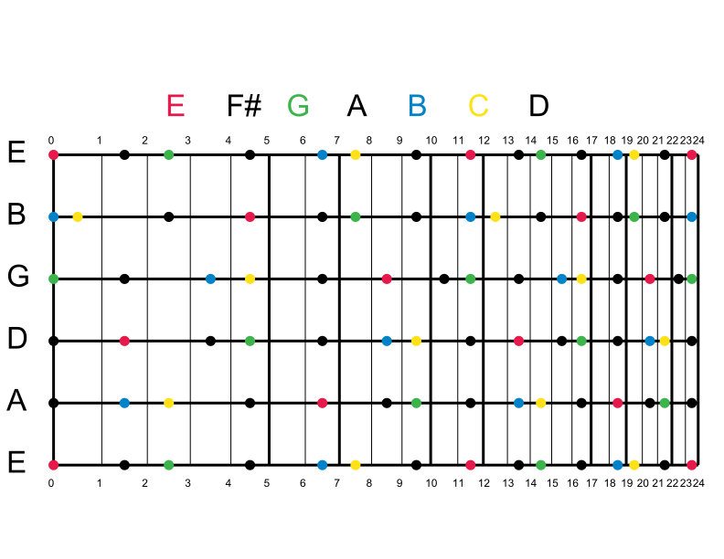
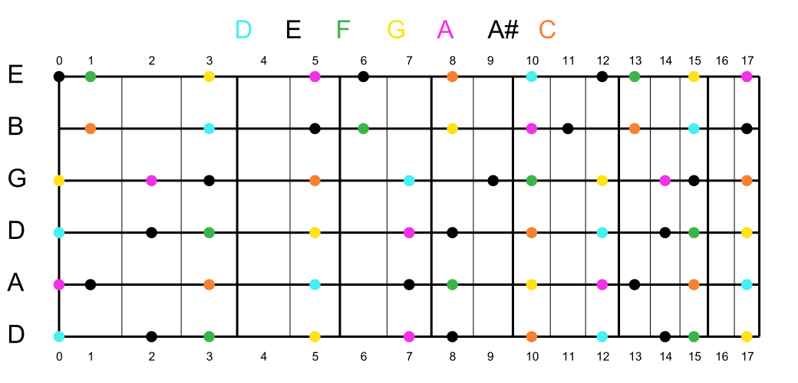
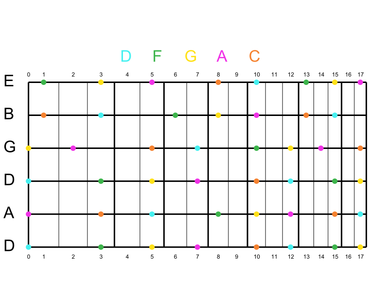
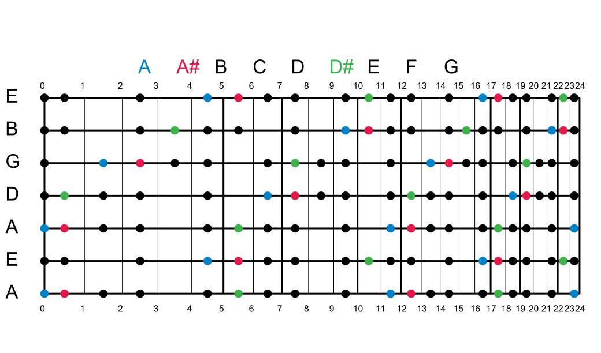
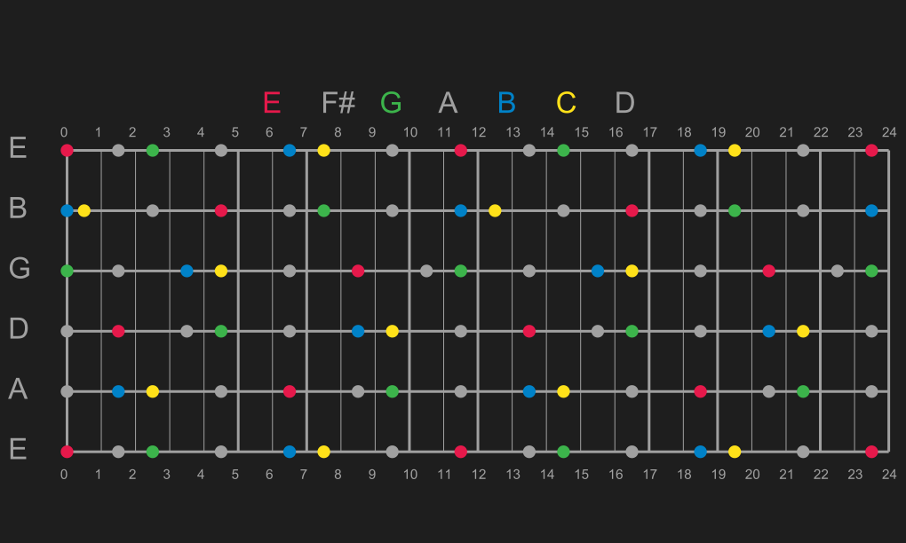

# Fretboard Scale Images

This is a python program that displays color coded musical scales on a fretboard for any fretted stringed instrument. Any scale consisting of any subset of [A, A#, B, C, C#, D, D#, E, F, F#, G, G#] can be input. The number of strings, number of frets, tuning, and color coding are configurable.

I was inspired to write this program after watching [this video](https://www.youtube.com/watch?v=wts2Mw6Nb5s) and experimenting with the idea. I made one of these scales by hand on a piece of paper for E minor. I screwed up twice and had to completely restart, so it took about one very frustrating hour to make. However, that piece of paper has been so helpful over the past month I've had it. I've come up with some riffs I don't think I would have ever found without it. So, I decided to write this program. This program makes it extremely easy and fast to generate an Allan Holdsworth-like scale image for any scale for any fretted string instrument. I hope you enjoy it as much as me!

## Dependencies:

pycairo 1.18.2  
numpy 1.17.4

## Arguments:

### Required:

-s: Number of strings on your fretted instrument

-f: Number of frets on your fretted instrument

-t: A comma separated list of the notes your instrument is tuned to starting from lowest string

-n: A comma separated list of notes in your scale. 

-p: File path to save image to. Can be a .pdf, .png, or .svg file. File type for saving is deduced from this input.

### Optional:

-c: The colors to draw the scale notes in. There are three options for specifying note colors.
                            
1) It can be left blank. All scale notes will be drawn in black by default.
                            
2) A comma separated list of note:color pairs. For example, specifying the following will draw E notes in red, G notes in blue, C notes in teal, and any unspecified notes in black:
    -c e:r,g:b,c:t
                            
3) A comma separated list of colors for each note in your scale in the same order as your scale. A color must be specified for each note if this format is used. 

Duplicate colors are allowed for both options 2 and 3. The following colors are available:  
    r - red  
    o - orange  
    y - yellow  
    g - green  
    c - cyan  
    b - blue  
    m - magenta  
    t - teal  
    k - black # MATLAB haunts me  
    p - pink  
    l - lavender  
    n - navy  
    w - white  

These colors were chosen because they can be easily abbreviated by 1 letter and supposedly [can be easily distinguished by 95% of population](https://sashat.me/2017/01/11/list-of-20-simple-distinct-colors/)
    
-w: Output image width

-h: Output image height

-m: Multiplier for note marker radius. Must be greater than 0.

-r: Turn realistic fretboard spacing on or off. Maybe be useful if you want to make note markers bigger. It resolves to a boolean value, but can be specified as any of the following:
    True - yes, true, t, y, 1  
    False - no, false, f, n, 0  

## Examples

E Minor is [E, F#, G, A, B, C, D]. Let's say we want to highlight the root, the minor third, the fifth, and the minor sixth, so [E, G, B, C]. We want to highlight these notes as red, green, blue, and yellow respectively. We will do this for a 6 string guitar with 24 frets in standard tuning. If you do not understand these command line arguments, please scroll up and read the Arguments section.

`python fretboard_scale_image.py -s 6 -f 24 -t e,a,d,g,b,e -n e,f#,g,a,b,c,d -c e:r,g:g,b:b,c:y -p e_minor_standard.svg`

This will save an e_minor_standard.svg in your current folder. You can open it in a browser. If you'd prefer, you can change the extension to .pdf or .png and open it with a PDF of PNG viewer. Notice that the notes we did not specify a color for are black by default.

D Minor is [D, E, F, G, A, A#, C]. This time let's highlight the pentatonic minor scale within D Minor, so [D, F, G, A, C]. We will use the colors cyan, green, yellow, magenta, and orange respectively. We will specify a default color of black for the other notes. We will do this for a 6 string guitar with 17 frets in drop D tuning.

`python fretboard_scale_image.py -s 6 -f 17 -t d,a,d,g,b,e -n d,e,f,g,a,a#,c -c c,k,g,y,m,k,o -p d_minor_drop_d.svg`

Notice that this time we specified a color for each note in the notes list. These colors are applied in order. If you don't like that unspecified notes default to black when using note:colors pairs, this would be the way to specify colors.

Let's say you like the color scheme we just chose for D Pentatonic Minor, but you don't like that E and A# show up as black circles. We can easily remove them like so:

`python fretboard_scale_image.py -s 6 -f 17 -t d,a,d,g,b,e -n d,f,g,a,c -c d:c,f:g,g:y,a:m,c:o -p d_pentatonic_minor_drop_d.svg`

Let's take a look at the ["Metallica Scale"](https://www.youtube.com/watch?v=UuqvZDDm_bk) for A minor. The "Metallica Scale" is just taking a minor scale and adding in a minor 2nd (flat 2, A# in A Minor) and a tritone (flat 5th, D# in A Minor). So, we have [A, A#, B, C, D, D#, E, F, G]. Let's highlight the root in blue, the minor 2nd in red and the tritone in green. We will do this for a 7 string guitar with 24 frets tuned to drop A. Let's also change the image size for illustrative purposes.

`python fretboard_scale_image.py -s 7 -f 24 -t a,e,a,d,g,b,e -n a,a#,b,c,d,d#,e,f,g -c a:b,a#:r,d#:g -p a_metallica_scale_drop_a.svg -w 1040`

You can also turn off realistic fret spacing and change note marker sizes. Let's do this for an E Minor scale:

`python fretboard_scale_image.py -s 6 -f 24 -t e,a,d,g,b,e -n e,f#,g,a,b,c,d -c e:r,g:g,b:b,c:y -w 900 -h 525 -r false -m 1.5 -p e_minor_big_markers_even_spaced.svg`

